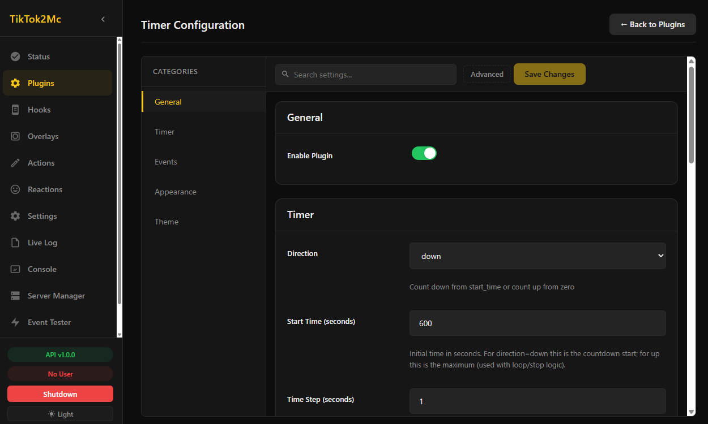
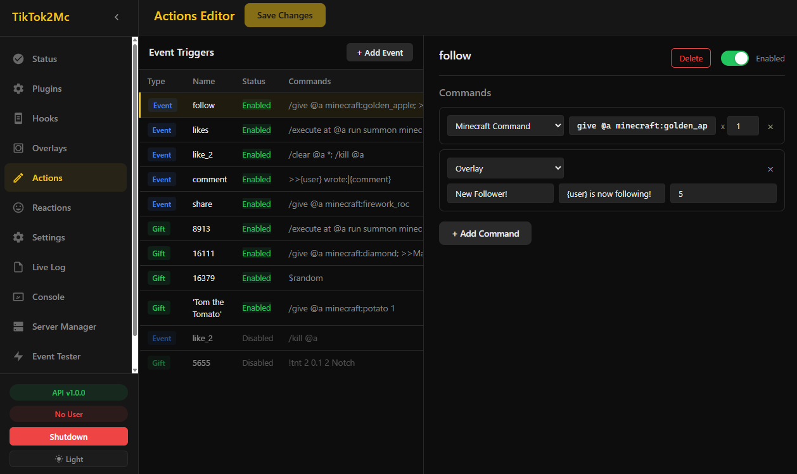
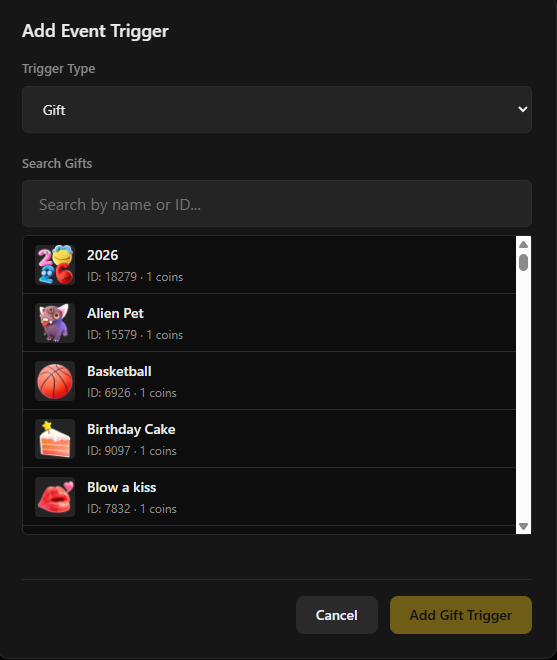

# TikTok2Mc — User Guide

This guide explains how to use TikTok2Mc. No programming knowledge is required.

If you want to learn more about the tool or develop your own plugins, see the developer documentation:
- [English Developer Docs](./dev-book-en/src/ch01-00-getting-started.md)
- [German Developer Docs](./dev-book-de/src/ch01-00-getting-started.md)

The recommended way to configure and control TikTok2Mc is the **Dashboard** (GUI) at `http://127.0.0.1:29185/` (or the desktop application). Everything can be done there — no file editing needed:

> [!NOTE]
> The Dashboard also provides additional help and validation, which reduces the chance of misconfiguration.
> The configuration files are still available for advanced users who prefer to edit them directly.
> Keep in mind that a mistake in these files can break the tool.

- **Dashboard (GUI)** — The web interface is the primary way to configure and control the tool. It is the only place to enable plugins and to run the setup wizard.
- **Configuration Files** — `config.yaml` and other files can also be edited directly with any text editor. This is optional and only needed for advanced tweaks.
- **Mixed** — Use both. Changes from the GUI and files are synchronized automatically.

You cannot open the setup wizard from the Dashboard later; it only appears on first launch (or while the TikTok username and RCON password are still set to defaults). If you miss it, the same settings are available in **Settings → Connection**.

---

## Table of Contents

- [Installation](#installation)
- [Configuration](#configuration)
- [Setup Wizard](#setup-wizard)
- [Actions and Triggers](#actions-and-triggers)
- [Event-Command Mapper](#event-command-mapper)
- [Comment Commands](#comment-commands)
- [Plugins](#plugins)
- [Overlays](#overlays)
- [The Dashboard](#the-dashboard)
- [Server Manager](#server-manager)
- [Updating the Tool](#updating-the-tool)
- [Troubleshooting](#troubleshooting)
- [FAQ](#faq)

---

## Installation

### Windows

Download `TikTok2MC-Setup.exe` from the [Releases page](https://github.com/TechnikLey/Tiktok2Mc/releases) and run it. The installer guides you through setup:

- **Basic** — quick install with default settings
- **Advanced** — choose which components to install (Plugins, Minecraft Server, Documentation), set GUI mode, Java path, and port

The installer creates desktop and Start Menu shortcuts. Use Windows Add/Remove Programs to uninstall.

### Linux

Download `TikTok2Mc-Linux-Setup.sh` from the Releases page. Open a terminal, navigate to the download folder, and run:

```bash
chmod +x TikTok2Mc-Linux-Setup.sh
./TikTok2Mc-Linux-Setup.sh
```

The installer places the tool in `~/.local/share/TikTok2Mc` (no root required for the installation itself) and creates a `tiktok2mc` command and a desktop entry. Note that **running** the tool on Linux requires root privileges (`sudo`) — this is a separate step from the installation. If `~/.local/bin` is not on your `PATH`, the installer shows you how to add it.

### Portable version

A portable ZIP (Windows) or tar.gz (Linux) is also available. Extract it anywhere and run the tool directly.

---

## Configuration

All main settings are in `config/config.yaml`. Open this file with any text editor.

**Every setting has a comment above it explaining what it does.** Read the comments — they tell you exactly what each option controls.

### Minimum required changes

1. **Your TikTok username** — under `tiktok.user`. Enter your username without the `@` symbol.
> [!IMPORTANT]
> Do not enter your display name here — TikTok can only identify you by your username.
2. **Your RCON password** — under `rcon.password`. Change this from the default to something secure. This password connects the tool to your Minecraft server. The tool will ask you to set one on first start if left empty.
3. **Which features are enabled** — each section has `enabled: true` or `enabled: false`. Everything starts turned off. Turn on only what you need.

### Plugin-specific config files

Each plugin (e.g. Timer, Spotify Control) has its own `config.yaml` inside its plugin directory (e.g., `plugins/timer/config.yaml`). You can edit these files to change plugin-specific behavior like colors, timers, and milestones.

> [!TIP]
> The Dashboard (web interface) provides a visual editor for all settings. You don't need to edit files by hand unless you prefer to.



---

## Setup Wizard

The first time you start the tool (or if your TikTok username and RCON password are still set to defaults), a **Setup Wizard** opens automatically in the Dashboard. It walks you through three steps:

1. **TikTok Username** — enter your username (without the `@` symbol)
2. **RCON Password** — create a secure password (the wizard shows a strength meter)
3. **Review & Save** — check your settings and save

Saving immediately applies the settings (a reload and server restart happen behind the scenes). The wizard closes after saving and only appears again while the TikTok username or RCON password are still set to defaults — it cannot be reopened manually. If you skipped it, set the same values later in **Settings → Connection**. There is no "restart now or later" prompt and no separate way to relaunch the wizard.

---

## Actions and Triggers
You can edit actions through the GUI or directly in the `actions.mca` file.



The file `data/actions.mca` controls what happens in Minecraft when TikTok events occur.

> [!NOTE]
> The `actions.mca` file is only read at startup, so changes take effect the next time the tool starts.
> It is also recommended to install the language server, as it provides IntelliSense and marks errors.
> Errors are also detected when the tool starts — if an error occurs, the system will not start.

### How it works

Each line has two parts, separated by a colon:

```
Trigger:Command
```

**Trigger** — what causes the action. This can be:
- A gift ID (like `5655`)
- A gift name in quotes (like `'Tom the Tomato'`)
- `follow` — someone follows your account
- `join` — someone joins your stream
- `comment` — someone writes a comment
- `share` — someone shares your stream
- `likes` — like milestone reached (default: every 100 likes)
- `like_2` — second like milestone reached (default: 100,000 likes)

**Command** — what happens in Minecraft. The first character tells the tool what kind of command it is:

| Symbol | What it means | Example |
|--------|--------------|---------|
| `/` | Normal Minecraft command | `/give @a minecraft:diamond` |
| `!` | Server plugin command | `!tnt 5 0.5 2` |
| `$` | Special action | `$random` |
| `>>` | Show text on your stream overlay | `>>New Follower!\|{user}\|5` |
| `&` | Shell / system command | `&curl -X POST http://localhost:29187/add` |

### Simple examples

```
# When someone follows, give everyone a golden apple
follow:/give @a minecraft:golden_apple 7

# When gift 5655 is received, spawn an Evoker
5655:/execute at @a run summon minecraft:evoker ~ ~ ~

# When someone follows, show a message on stream
follow:>>New Follower!|{user} is now following you!|5

# When gift 16071 is received, pick a random action
16071:$random
```

### Chaining commands

Use `;` to run multiple commands from one trigger:

```
follow:/give @a minecraft:golden_apple 7; >>New Follower!|{user}!|5
```

### Repeating commands

Add `xN` to run a command multiple times:

```
8913:/execute at @a run summon minecraft:evoker ~ ~ ~ x3
```

This spawns 3 Evokers instead of 1.

### Overlay text

The `>>` command shows text on your stream. Format:

```
>>Title|Subtitle|Duration
```

- **Title** — main text (large)
- **Subtitle** — smaller text below
- **Duration** — how many seconds it stays visible

**Named overlays:** Use `@name>>` to send text to a specific overlay slot:

```
follow:@alerts>>New Follower!|{user}!|5
```

Define overlay names in `config.yaml` under `overlay.overlays` (at least `default` is required).

**Placeholders:**
- `{user}` — replaced with the viewer's TikTok username
- `{comment}` — replaced with the comment text (only for `comment` trigger)

Example:

```
comment:>>{user} wrote:|{comment}|3
follow:>>New Follower!|{user} is now following you!|5
```

### The `$random` action

`$random` picks a random action from your list and runs it. Good for variety.

```
16071:$random
```

You can control which triggers are eligible in the Random hook's config file (`hooks/random/config.yaml`). Set `mode: deny-all` to exclude the listed triggers from the random pool, or `mode: allow-only` to only allow the listed triggers.

To prevent infinite loops, chained triggers are limited to a depth of 3 — if a chain gets deeper (e.g. `$random` keeps picking a trigger that maps back to `$random`), the offending trigger is permanently banned for the session.

### Commenting out lines

Lines starting with `#` are treated as comments and are ignored.

```text
# This is a comment
```

Lines starting with `##` are also ignored, but are specifically used to **deactivate an action**:

```text
##follow:/say Thanks for the follow!
```

From the parser's perspective, there is technically no difference between `#` and `##` — both are ignored. The distinction exists for the GUI.

The GUI cannot reliably determine whether a commented-out line was originally a trigger or simply a regular comment. Therefore, `##` provides an explicit way to mark a disabled action.

* `#` → regular comment
* `##` → disabled action/trigger, identifiable by the GUI

This allows the GUI to distinguish between ordinary comments and intentionally deactivated triggers or actions without changing how the parser handles comments.

If you are not using the GUI, you can use `#` or `##` for either purpose, since both are treated the same by the parser. However, keeping regular comments and disabled actions separate is cleaner and allows the GUI to identify them correctly.
Additionally, some plugins or hooks may rely on this distinction, treating `#` as a regular comment and `##` as a disabled trigger. Using them incorrectly could therefore cause unexpected behavior or compatibility issues.

### Gift IDs

A full list of gift IDs and names is available in `core/gifts.json`. The Dashboard also includes a gift picker with search.



---

## Event-Command Mapper

The file `data/event_commands.yaml` connects events from your Minecraft world (like a player dying) to plugin actions (like pausing the timer).

This is useful for automating reactions — for example:
- When a player dies, pause the timer
- When the timer hits zero, add a win
- When a player respawns, resume the timer

### How it works

Each entry has an **event type** and a list of **actions** to run:

```yaml
event_commands:
  minecraft.player_death:
    - target: timer
      command: pause
    - target: spotify-control
      command: pause
  minecraft.player_respawn:
    - target: timer
      command: resume
  timer.zero:
    - target: win-counter
      command: add_win
      args:
        amount: 1
```

**Available event types:**
- `minecraft.player_death` — a player dies
- `minecraft.player_respawn` — a player respawns
- `timer.started`, `timer.paused`, `timer.resumed`, `timer.reset` — timer state changes
- `timer.tick`, `timer.zero`, `timer.milestone` — timer progress events
- `server.started`, `server.stopping` — server lifecycle events

**Available targets:**
- `timer` — send commands to the Timer plugin
- `spotify-control` — send commands to the Spotify plugin
- `death-counter` — send commands to the Death Counter plugin
- `win-counter` — send commands to the Win Counter plugin

**Available commands per target:**

| Target | Commands |
|--------|----------|
| timer | `start`, `pause`, `resume`, `reset`, `add_time`, `set_time`, `save_dims` |
| spotify-control | `play`, `pause`, `next`, `previous`, `volume`, `volume_up`, `volume_down`, `shuffle`, `repeat`, `save`, `playtrack` |
| win-counter | `add_win`, `remove_win`, `save_dims` |
| death-counter | `player_death`, `add_death`, `reset`, `save_dims` |

The Event-Command Mapper can also be edited visually in the Dashboard.

---

## Comment Commands

Let viewers send commands via TikTok chat. Each command group has its own prefix character.

**Example:** A moderator types `#say Hello` and the tool sends `say Hello` to the Minecraft server.

### How it works

Commands are organized into **groups**. Each group has:
- A **prefix** (like `#` or `$`) that triggers it
- **Allowed roles** (who can use it)
- A **mode** (`deny-all` or `allow-all`)
- A **commands list**
- Individual **cooldowns** and other settings

### Default groups

The default `config.yaml` includes two groups:

1. **`#` group** — Minecraft commands via RCON. Only moderators and superfans can use it.
2. **`$` group** — Spotify control. Anyone can use it.

### Security

RCON commands send raw commands to your Minecraft server. If you allow `all` roles, use `deny-all` mode and only list safe commands.

### Cooldowns

Each group can have cooldowns to prevent spam:
- `cooldown` — seconds between any command in this group
- `user_cooldown` — seconds the same viewer must wait before their next command

Global cooldowns also exist at the top of the `comment_commands` section and apply across all groups.

### Per-command overrides

You can override settings for individual commands using `commands_config`:

```yaml
commands_config:
  skip:
    cooldown: 30
  volume:
    roles:
      - moderator
  playtrack:
    conditional: true
```

### Trigger comment event

Each group has a `trigger_comment_event` setting (default: `true`). When set to `false`, commands in that group won't fire the `comment` trigger in `actions.mca`.

> For full details, read the inline comments in `config.yaml` under `comment_commands`.

---

## Plugins

Plugins are optional features you can turn on or off.

### How to enable a plugin

1. Open the **Plugins** page in the Dashboard.
2. Find the plugin you want and toggle it on.
3. Some plugins have additional setup (see below).

> [!NOTE]
> Everything starts disabled. Only turn on what you actually need.

### Available plugins

| Plugin | What it does | Overlay URL |
|--------|-------------|-------------|
| **Timer** | Countdown or count-up timer for your stream | `http://127.0.0.1:29185/api/v1/plugins/timer/overlay` |
| **Death Counter** | Counts player deaths automatically | `http://127.0.0.1:29185/api/v1/plugins/death-counter/overlay` |
| **Win Counter** | Tracks wins and losses | `http://127.0.0.1:29185/api/v1/plugins/win-counter/overlay` |
| **Spotify Control** | Viewers control your Spotify via chat | `http://127.0.0.1:29185/api/v1/plugins/spotify-control/overlay` |

### Timer

A configurable timer for your stream. Can count down from a set time or count up from zero.

**Settings** (in the Dashboard under Plugins → Timer, or in `plugins/timer/config.yaml`):
- `direction` — `down` (countdown) or `up` (count up)
- `start_time` — starting time in seconds
- `auto_start` — start automatically when the tool loads
- `loop` — when counting down, reset to start time instead of pausing at zero
- `format` — display format: `mm:ss`, `hh:mm:ss`, or `seconds`
- `theme` — customize colors (background, text, warning, blink, danger)

Control it via chat commands (if configured), the Dashboard, or the Event-Command Mapper.

### Death Counter

Automatically detects player deaths and counts them. No setup needed beyond enabling.

The counter updates in real-time on the overlay. You can configure milestones that trigger events in the Event-Command Mapper.

### Win Counter

Tracks wins and losses. Configure how many wins are needed for each milestone.

**Settings** (in the Dashboard under Plugins → Win Counter, or in `plugins/win-counter/config.yaml`):
- `initial_needed` — wins required for the first milestone
- `milestone_increment` — additional wins needed for each next milestone

Use the Event-Command Mapper to add wins automatically (e.g., when the timer hits zero).

### Spotify Control

Lets viewers control your Spotify playback through TikTok chat. Viewers can type commands like `$play`, `$pause`, `$skip`, `$volume 50`.

**Setup:**
1. Go to [Spotify Developer Dashboard](https://developer.spotify.com/dashboard) and create an app.
2. Add `http://127.0.0.1:29185/api/v1/plugins/oauth/callback?name=spotify-control` as a Redirect URI.
3. Enter your Client ID and Client Secret in the Dashboard (Plugins → Spotify Control → Config), or directly in `plugins/spotify/config.yaml`.
4. Enable the plugin in the Dashboard (Plugins → toggle Spotify Control on).
5. On first start, your browser will open for Spotify login.

**Settings:**
- `volume_step` — percent change per volume up/down command (default: 10)
- `playtrack_mode` — `replace` (play immediately) or `queue` (add to queue)
- `theme` — customize colors (background, text, accent)

The overlay shows the current track with album art.

> You also need to enable the `$` comment command group (under `comment_commands` in the Dashboard's Settings, or in `config.yaml`) for chat commands to work.

---

## Overlays

Overlays are web pages you can add as a **Browser Source** in OBS Studio (or any streaming software).

### Overlay types

There are two types of overlays:

1. **Plugin overlays** — provided by plugins (Timer, Death Counter, Win Counter, Spotify Control). Each has its own URL.
2. **Core overlay** — displays text messages triggered by `>>` commands in `actions.mca`. Served at `http://127.0.0.1:29185/api/v1/overlay?overlay=default`.

### How to add an overlay to OBS

1. In OBS, click the **+** under Sources and select **Browser Source**.
2. Enter a name (like "Death Counter").
3. Paste the plugin's overlay URL from the table above.
4. Set the width and height to match your stream resolution (1920x1080 for 1080p, 1280x720 for 720p).
5. Click **OK**.

The overlay will update automatically when events occur.

### Core overlay (text messages)

The core overlay at `/api/v1/overlay` shows text messages triggered by `>>` commands. You can create multiple named overlays:

- `http://127.0.0.1:29185/api/v1/overlay?overlay=default`
- `http://127.0.0.1:29185/api/v1/overlay?overlay=alerts`

Define overlay names in `config.yaml` under `overlay.overlays`, then target them with `@name>>` in `actions.mca`.

### Display modes

The core overlay supports two display modes (set in `config.yaml` under `overlay.display_mode`):

- **overwrite** — new messages replace the current one immediately
- **queue** — messages line up and display one after another

### Chroma key

For chroma key (green screen) support, add `&chroma=true` to the overlay URL:
`http://127.0.0.1:29185/api/v1/overlay?overlay=default&chroma=true`

---

## The Dashboard

The Dashboard is a web interface available at `http://127.0.0.1:29185/` that lets you manage everything visually. No file editing required.
It is also available as a desktop app.

### What you can do in the Dashboard

- **Edit Actions** — visual table of event triggers with inline command editing. Add events by type (follow, join, comment, likes, share) or use the gift picker with search. Changes save with validation.
- **Edit Configuration** — form-based editor with section navigation (Connection, Minecraft, Chat & Commands, System). Search filters across all settings. Validation prevents invalid values. Overlay theme colors can be previewed live before saving.
- **Plugin Configuration** — each plugin has its own settings page with form fields, category sidebar, and search.
- **Event Commands** — visually edit the Event-Command Mapper.
- **Server Manager** — create and manage Minecraft server instances (see below).
- **Live Theme Editor** — adjust overlay colors and preview changes in real time without saving.
- **Check for Updates** — click "Check for Updates" in the Updates card.
- **API Documentation** — visit `http://127.0.0.1:29185/docs` for interactive API reference.

---

## Server Manager

The Server Manager (in the Dashboard) lets you create and manage multiple Minecraft server instances from one place.

### Server instances

Each server instance has its own:
- **Name** — a label to identify it
- **Version** — which PaperMC version it runs
- **Status** — shown with a color-coded indicator (running, stopped, etc.)
- **Port** — the server port
- **Save folder** — worlds, configs, and mods

A **default** instance is always present. You can create additional instances for different game modes, maps, or testing.

### What you can do

- **Start, stop, or restart** any instance with one click
- **Switch versions** — change the PaperMC version per instance
- **Create new instances** — set a name, port, and version
- **Delete instances** — non-default instances can be removed
- **Open folder** — access the server files directly

### Console access

A drop-down selector lets you switch between instances to view each server's console output in real time.

---

## Updating the Tool

The tool checks for updates automatically on startup (enabled by default). If a new version is available, it downloads and installs it.

**Before updating, back up these files:**
- `config/config.yaml` — your settings
- `data/actions.mca` — your action rules
- `data/event_commands.yaml` — your event mappings
- `server/default/` — your Minecraft world

Copy them to a safe location outside the tool folder.

### Configuration migration

When you update, new configuration options are automatically merged into your existing `config.yaml` if `auto_update_config` is enabled (default: true). Your user-defined values are preserved.

**To disable auto-updates:**
Set `update.enabled: false` in `config.yaml`.

> [!WARNING]
> Disabling this can cause the tool to malfunction or crash.
> Only set this to `false` if you want to rename or add your own settings, or if you expect the tool to crash.

**To check for updates manually:**
Open the Dashboard (`http://127.0.0.1:29185/`) and click "Check for Updates" in the Updates card, or visit `http://127.0.0.1:29185/api/v1/updates/check` directly.

---

### Error codes in logs

If you see a code like `[HOOK-0005]` or `[API-0012]` in the console output, it is an **error code** that helps identify the problem. You can look up all error codes at `http://127.0.0.1:29185/api/v1/diagnostics/error-codes` when the tool is running, or check the error-code reference in the developer docs (`docs/dev-book-en/src/error-codes.md` or `docs/dev-book-de/src/error-codes.md`).

### Health and diagnostics

The Dashboard has a **Live Plugin Health** card that shows the status of all components with color-coded indicators. For a full system report, visit:

- `http://127.0.0.1:29185/api/v1/health` — basic health check
- `http://127.0.0.1:29185/api/v1/health/extended` — detailed health info
- `http://127.0.0.1:29185/api/v1/diagnostics` — full diagnostics report (threads, crash history, component states)

---

## FAQ

**Q: Do I need to be live on TikTok for the tool to work?**

A: No. The tool also works without TikTok — you can trigger actions manually or with automation scripts. It is up to you.

**Q: Can I test actions without going live?**

A: Yes. Use the included test tool (`test/test_trigger.exe` on Windows or `test/test_trigger.bin` on Linux). Enter a trigger name (like `follow` or a gift ID) to simulate it.

**Q: How do I know if the tool is working?**

A: The console window shows live output. If you see "Connected to TikTok" and the Minecraft server starts without errors, everything is running.
You can also use test triggers (see above) or check the Live Logs tab in the GUI — if you see no errors, the tool should run properly.

**Q: How often is the tool updated?**

A: There is no fixed schedule. Updates come out when new features or fixes are ready.

**Q: Can I use a different Minecraft version?**

A: Yes. Use the Server Manager in the Dashboard to switch the version, or replace the `.jar` file in `server/default/`. The new server must support RCON and datapacks (most do). The default version is 1.21.11 (PaperMC).

**Q: Can I use modded servers (Forge, Fabric, Paper)?**

A: Yes. Replace the server `.jar` as described above. Make sure the modded server supports RCON and datapacks.

**Q: Does the tool work with Minecraft Bedrock Edition?**

A: No. Only Java Edition supports the features this tool needs.

**Q: Can I run the Minecraft server on a different computer?**

A: Yes. Set `server_host` (the address the tool connects to for RCON) and `rcon.port` in `config.yaml` to match your remote server, and make sure RCON is enabled there. The tool itself must still run on your streaming PC.

**Q: Can I use the overlays without OBS?**

A: Yes. The overlays are web pages. You can open them in any browser or add them to any streaming software that supports Browser Sources.

**Q: How do I find gift IDs?**

A: The Dashboard includes a **gift picker** that searches gifts by name or ID with image URLs and coin cost. You can also open `core/gifts.json` directly.

**Q: Can I use the tool with Twitch or YouTube?**

A: The tool is designed for TikTok Live. The license restricts commercial use on other platforms.

**Q: My server is lagging. What can I do?**

A: Increase the RAM allocation in `config.yaml` under `java.xms` and `java.xmx`. Also avoid using `comment` or `join` triggers with complex commands on busy streams.

**Q: Can viewers spam commands?**

A: Use cooldowns in `config.yaml` under `comment_commands` to limit how often commands can be used. You can set per-group and per-user cooldowns.

**Q: How do I use chroma key / green screen for overlays?**

A: Add `&chroma=true` to any core overlay URL. For plugin overlays, check the plugin's overlay page for chroma key support.

---

## Additional Resources

- **README:** [README.md](../README.md) — quick start and overview
- **Changelog:** [CHANGELOG.md](./CHANGELOG.md) — release history
- **GitHub:** [https://github.com/TechnikLey/Tiktok2Mc](https://github.com/TechnikLey/Tiktok2Mc)
- **Report Issues:** [GitHub Issues](https://github.com/TechnikLey/Tiktok2Mc/issues)
- **API Docs:** `http://127.0.0.1:29185/docs` — interactive API reference (when the tool is running)